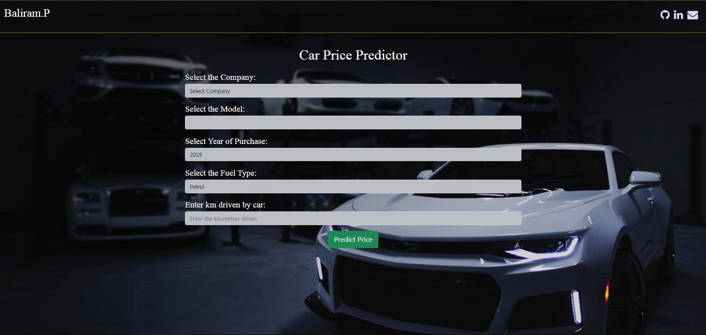
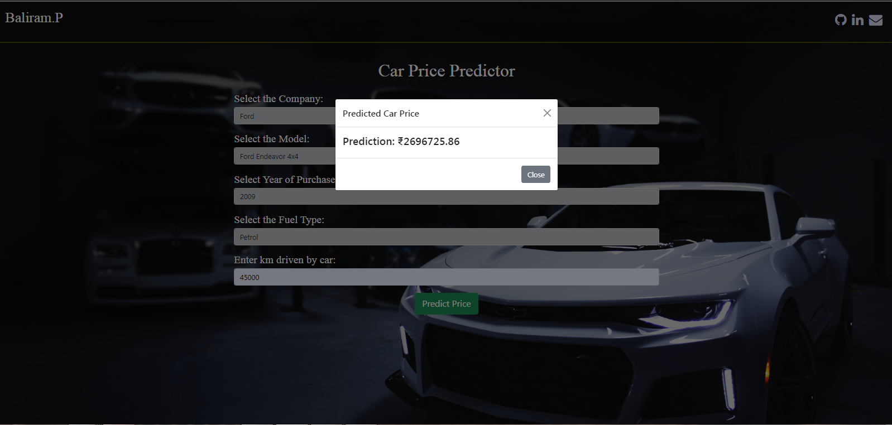

<h1 align="center">Car Price Predictor</h1>

<!--Project Link: [Car-Price-Predictor](https://car-price-predictor-ml.herokuapp.com/)-->

1. Car Price Predictor takes the parameters of an used car: Company name, Model name, Year of Purchase, Fuel Type and Number of Kilometers it has been driven.
2. It then predicts the possible price of the car with the help of linear regression.
 
Below image shows the graphical user interface (GUI) of the Car Price Predictor

The predicted price for the car Ford Endeavor 4x4 is shown below

# The flow of the Car Price Predictor

1. The data file was scraped from the (https://quikr.com)

Link: [quikr_car Dataset](https://github.com/balirampansare/car-price-prediction/blob/main/quikr_car.csv)

2. The data was cleaned and analysed.

Link: [Cleaned Dataset](https://github.com/balirampansare/car-price-prediction/blob/main/cleaned_car.csv)

3. Then a Linear Regression model was built on top of it which had 0.88 R2_score.

Link: [Car Price Predictor](https://github.com/balirampansare/car-price-predictor/blob/main/Car%20Price%20Prediction%20With%20GUI.ipynb)

4. Website is created using Flask and the implementation of Linear Regression to predict the price of the car.
    1. Flask File: [application](https://github.com/balirampansare/car-price-prediction/blob/main/application.py)
    2. GUI (HTML File): [index](https://github.com/balirampansare/car-price-prediction/blob/main/templates/index.html)
